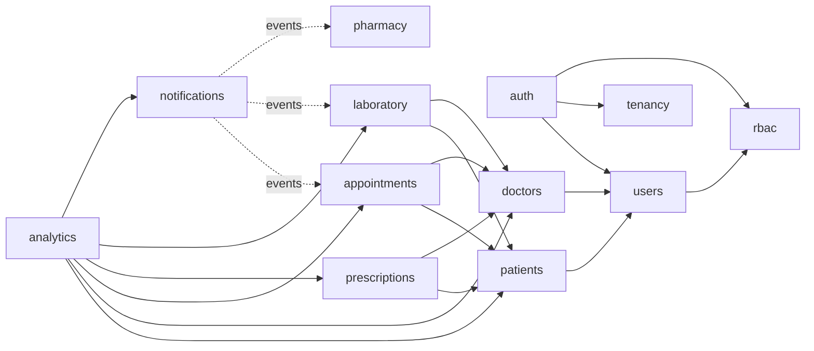

# MedFlow AI — Backend

Java 21 / Spring Boot 3.4 **modular monolith** (Spring Modulith) powering the MedFlow AI
clinical operating system. Every functional area of the MedFlow UI — dashboard, doctors,
patients, appointments, prescriptions, laboratory, pharmacy, reports & analytics,
notifications, AI assistant, user management, settings and authentication — is backed by
a dedicated, boundary-verified application module, on a **multi-tenant PostgreSQL schema
that follows the MedFlow database design** (ArchitechDB).

* **[LOCAL_SETUP.md](LOCAL_SETUP.md)** — run backend + UI on your machine, step by step
* **[PGADMIN_SETUP.md](PGADMIN_SETUP.md)** — create and inspect the database in pgAdmin

The React UI in `medflow-ui/Medflow-UI-Repo/medflow-ai` is wired to these endpoints:
sign-in, dashboard, doctors, patients, appointments, prescriptions, laboratory, pharmacy,
notifications, users, settings and the assistant all read and write live data. Start the
backend, run `npm run dev`, sign in at <http://localhost:5173>.

---

## Quick start

```powershell
# 1. Create the database (once), connected to "postgres" as a superuser:
#    CREATE DATABASE medflow ENCODING 'UTF8' TEMPLATE template0;
#    See PGADMIN_SETUP.md for the click-by-click version.

# 2. Run it — Flyway builds the schema and seeds a demo hospital
mvn spring-boot:run
```

| URL | What |
|---|---|
| `http://localhost:8080/swagger-ui.html` | Interactive API docs (supports Bearer auth) |
| `http://localhost:8080/health` | Public liveness endpoint |
| `http://localhost:8080/actuator/health` | Actuator probes |
| `http://localhost:8080/actuator/prometheus` | Prometheus metrics |

Sign in with the seeded administrator — `admin@medflow.local` / `Admin@12345` — or create
your own workspace:

```bash
curl -X POST http://localhost:8080/api/v1/auth/register \
  -H "Content-Type: application/json" \
  -d '{"fullName":"Ananya Rao","email":"ananya@hospital.com","password":"changeit-123","confirmPassword":"changeit-123","hospitalName":"City Care Hospital"}'
```

Registration provisions a **whole workspace**: the hospital, its module entitlements and
the first ADMIN account. The response contains a JWT — pass it as
`Authorization: Bearer <token>` on every other call (or click *Authorize* in Swagger UI).

> No PostgreSQL at hand? `mvn test` proves the application end to end against in-memory
> H2 in PostgreSQL mode — migrations, security chain, events and all.

---

## Tech stack

| Concern | Choice |
|---|---|
| Language / runtime | Java 21 |
| Framework | Spring Boot 3.4 (Web MVC, Data JPA, Validation, Security, Actuator) |
| Modularity | Spring Modulith 1.3 — build-time verified module boundaries |
| Auth | Spring Security OAuth2 Resource Server, HS256 JWT (no extra JWT library) |
| Database | PostgreSQL 14+ (verified on 17), Flyway migrations in module-owned folders |
| Cache | Caffeine, 30-second TTL, by default; Redis via `CACHE_PROVIDER=redis` |
| Mapping | MapStruct where a mapping is a straight copy; hand-written where responses compose several modules |
| API docs | springdoc-openapi + Swagger UI |
| Metrics | Micrometer + Prometheus registry |
| Tests | JUnit 5, Spring Boot Test, Awaitility, H2 (PostgreSQL mode), Testcontainers available |

---

## Multi-tenancy

MedFlow is a product several hospitals use, so **the hospital is part of the data model,
not an afterthought**:

* every clinical or operational table carries `hospital_id`;
* the access token carries the caller's `hospitalId`, and services scope queries by
  `TenantContext.hospitalId()` rather than by any identifier the client sends — guessing
  another tenant's row id gets you a 404, not their data;
* `POST /api/v1/auth/register` creates a tenant; there is deliberately no endpoint that
  lists hospitals.

The smoke test asserts this: a workspace created mid-test sees exactly its own one doctor
and one patient, never the demo hospital's three and five.

---

## Architecture

### Modular monolith

A single deployable with **hard internal boundaries** enforced by
`ApplicationModules.verify()` in the test suite (`ModularityTest`). A module may only
touch another module's **published API** (its `api` package tree) or subscribe to its
**domain events** — never its entities, repositories or services.

```
com.medflow
├── MedflowApplication            @Modulithic entry point
├── config/                       Framework wiring (security, cache, OpenAPI, async, clock)
├── shared/                       OPEN shared kernel: ApiResponse envelope, PageResponse,
│                                 exceptions, @PublicApi marker, TenantContext, trace-id
│                                 filter, cross-cutting enums and their JPA converters
└── modules/
    └── <module>/
        ├── package-info.java     @ApplicationModule declaration
        ├── api/                  @NamedInterface — service interface, enums, events
        │   ├── request/          @NamedInterface — inbound DTOs (validated records)
        │   └── response/         @NamedInterface — outbound DTOs (records)
        ├── application/          Service implementations (package-private)
        ├── controller/           Thin REST layer (package-private)
        ├── domain/
        │   ├── entity/           Rich JPA aggregates with behavior + invariants
        │   └── repository/       Spring Data repositories, Specifications
        └── mapper/               MapStruct entity → DTO mappers (where applicable)
```

### Modules

| Module | Owns | Notes |
|---|---|---|
| `tenancy` | `hospitals`, `modules_master`, `hospital_module_entitlements` | Tenant onboarding and the licensable module catalogue that drives UI navigation |
| `rbac` | `roles`, `permissions`, `role_permissions`, `user_groups`, `user_group_portal_access` | Reference data; resolves role/permission codes for tokens |
| `users` | `users` | Staff and portal accounts, role and portal group, password reset |
| `auth` | — | Credential exchange, workspace provisioning, JWT issuance |
| `doctors` | `doctors`, `doctor_availability`, `user_doctor_mapping` | Clinical profile attached to a user account |
| `patients` | `patients`, `patient_medical_history`, `patient_reports`, `user_patient_mapping` | Master record plus clinical history and documents |
| `appointments` | `appointments` | Booking, day queue and the consultation workflow |
| `prescriptions` | `prescriptions` | Diagnosis plus medication lines stored as JSON |
| `laboratory` | `lab_orders` | Test queue and results |
| `pharmacy` | `medications` | Catalogue, stock and reorder alerts |
| `notifications` | `notifications` | Event-fed workspace alert feed |
| `assistant` | `chat_messages` | Conversational assistant behind a swappable port |
| `analytics` | — | Composes KPIs from other modules' APIs; cached briefly |
| `settings` | `workspace_settings` | Per-hospital configuration |
| `audit` | `audit_logs` | Append-only trail of administrative actions |

### Module dependency graph



Solid arrows are synchronous API calls (e.g. appointments validates patient/doctor ids
and fetches display names through batch `summariesByIds(...)` lookups). Dotted arrows are
**event subscriptions** — notifications never calls other modules; it listens.

Cross-module references are **by identifier only**. There are no cross-module JPA
relations, so any module could later be extracted into its own service.

### Conventions

- **Response envelope** — every endpoint returns
  `{ success, message, data, errors[], timestamp, traceId }`. The `traceId` is generated
  (or propagated from `X-Trace-Id`) by a servlet filter, stored in the MDC, echoed in the
  response header and stamped into every log line.
- **Pagination** — list endpoints take `page`/`size` (size capped at 100) and return a
  stable `PageResponse` decoupled from Spring Data types.
- **Errors** — one `@RestControllerAdvice` maps exceptions to statuses:
  validation → 400, unauthenticated → 401, forbidden → 403, not found → 404,
  duplicate → 409, domain-rule violation → 422, anything else → 500 (logged, opaque).
- **Domain invariants live in the aggregates** — `Appointment` owns its state machine;
  `Medication.adjustStock()` refuses to go negative and reports reorder crossings;
  `DoctorAvailability` rejects a window that is neither weekly nor dated.

---

## Persistence & migrations

The schema implements the MedFlow database design (ArchitechDB): 19 designed tables plus
5 that back MedFlow modules the design does not cover (laboratory, pharmacy,
notifications, assistant, settings).

- **Flyway, module-owned** — each module keeps its DDL under
  `src/main/resources/db/migration/<module>/`, scanned recursively; version numbers are
  globally sequential (V1–V2 core, V3 users, V4 doctors, V5 patients, V6 appointments,
  V7 prescriptions, V8 laboratory, V9 pharmacy, V10 notifications, V11 assistant,
  V12 settings, V13 audit, V14 reference data).
- **Demo data** lives separately in `src/main/resources/db/demo` (V100) and is enabled by
  default through `spring.flyway.locations`. Drop that location for a clean database:
  `FLYWAY_LOCATIONS=classpath:db/migration`.
- **One-time DB bootstrap scripts** for pgAdmin/psql are in [`db/setup/`](db/setup).
- **`ddl-auto: validate`** — Hibernate never touches the schema; migrations are the single
  source of truth and startup fails fast on drift.

### Deliberate deviations from the design document

| Design | Implementation | Why |
|---|---|---|
| `enum` types (`gender_enum`, `appointment_status_enum`, …) | `VARCHAR` + `CHECK` constraint listing the same values, mapped by `LowerCaseEnumConverter` so rows still read `walk_in`, `no_show`, `pending_verification` | Keeps DDL portable so the full suite runs on in-memory H2 without Docker; adding an enum value stays a one-line migration instead of an `ALTER TYPE` |
| `text` columns | `VARCHAR(n)` with generous limits | Same portability reason; `text` maps to CLOB on H2 and breaks Hibernate's schema validation |
| `timestamp` | `TIMESTAMP WITH TIME ZONE` | Hospitals carry a `timezone`; instants must not silently shift |
| `users.email` unique per row | Globally unique | Sign-in is by email with no tenant selector in the UI, so an address must resolve to one account |
| — | `users.reset_token`, `users.reset_token_expires_at` | Supports the forgot-password flow |
| — | `appointments.reason`, `appointments.consultation_fee` | The fee is snapshotted at booking so later price changes never rewrite revenue history |
| — | `prescriptions.status`, `prescriptions.updated_at` | The UI's complete/cancel actions |

---

## Security model

- **Stateless JWT** — `POST /auth/login` issues an HS256 token via Spring Security's own
  `JwtEncoder` (Nimbus, no third-party JWT dependency). Every other request is validated
  by the OAuth2 resource-server filter chain; no server-side sessions.
- **Claims** — `sub` = user id, plus `hospitalId` (the tenant), `email`, `name`, `role`
  (role code), `permissions` (fine-grained codes for the UI) and `userUid`. The role claim
  maps to a `ROLE_*` authority consumed by `@PreAuthorize("hasRole('ADMIN')")`.
- **Private by default** — every endpoint requires authentication unless its handler is
  annotated `@PublicApi` (a custom marker resolved by a handler-aware request matcher).
  Adding a new controller cannot accidentally expose it.
- **Passwords** — BCrypt-hashed; 8–72 character policy (72 is the BCrypt input limit).
- **Password reset** — opaque 256-bit token, 30-minute TTL, single-use, and the API
  responds identically whether or not the email exists (no account enumeration).
- **Audit** — administrative actions (user created, role changed, doctor onboarded,
  patient updated, report attached …) are appended to `audit_logs` with the acting user,
  tenant and client IP, in a separate transaction so auditing can never fail the action
  it records.
- **CORS** — locked to configured origins (defaults include the Vite dev server).

---

## Cross-module events

Modules communicate significant facts through Spring Modulith application events
(`@ApplicationModuleListener` — async, after-commit, own transaction). The notifications
module turns them into the alert feed the UI shows:

| Event | Published by | Resulting notification |
|---|---|---|
| `AppointmentBookedEvent` | appointments | "Appointment booked — *patient* is scheduled with *doctor* at *time*" |
| `AppointmentScheduleConflictEvent` | appointments | ⚠ "Schedule conflict — *doctor* has overlapping bookings at *time*" |
| `LabOrderCompletedEvent` | laboratory | "Lab results ready — *patient*'s *test* results just came in" |
| `MedicationLowStockEvent` | pharmacy | ⚠ "Low stock alert — pharmacy flagged *medication* running low" |

Events carry the tenant and display names, so listeners need neither lookups nor a
security context.

---

## API surface

See the full route table in [LOCAL_SETUP.md](LOCAL_SETUP.md#8-api-map), or browse
Swagger UI. Highlights:

- **Appointments** follow the real front-desk workflow:
  `booked → confirmed → checked_in → in_consultation → completed`, with `cancelled` and
  `no_show` as exits. Each booking gets the doctor's next queue number for that day.
- **Doctors** are created together with their user account — the design models a doctor as
  a user with professional attributes, so the two can never drift apart.
- **Patients** carry medical history, uploaded reports and linked portal accounts
  (`self`, `parent`, `guardian`, …).
- **Prescriptions** store medication lines as JSON inside the signed record.
- **Analytics** returns the dashboard KPI card values and the weekly activity series.

---

## Testing

```powershell
mvn test
```

| Test | What it proves |
|---|---|
| `ModularityTest` | No module reaches into another module's internals; no dependency cycles. Fails the build on any boundary violation. |
| `MedflowSmokeTest` | Boots the **entire application** (Flyway → JPA validation → security chain) on H2 in PostgreSQL mode and walks the cross-module happy path: register a workspace (hospital + admin + entitlements) → onboard a doctor (creates the account, assigns `DOC-0001`) → register a patient (`PAT-000001`) → book an appointment (queue number 1) → an async event produces a notification → dashboard KPIs count **only that tenant** → the audit trail recorded the actions. |

Testcontainers (PostgreSQL) is on the test classpath for repository-level tests against
the real engine.

---

## Design decisions & trade-offs

- **Modular monolith over microservices** — one deployable with verified boundaries gives
  service-extraction options later without paying the distributed-systems tax now.
- **Tenant from the token, never from the request** — the alternative (a `hospitalId`
  parameter) turns every endpoint into a potential cross-tenant leak.
- **Conflicting bookings are flagged, not blocked** — the UI surfaces schedule conflicts
  as notifications ("Dr. Shah has two bookings at 2:00 PM"), so the domain follows:
  front-desk staff resolve conflicts; the system never silently rejects a patient.
- **Prescription medicines are a JSON document** — a prescription is a signed clinical
  record; it must read back exactly as written even if the pharmacy catalogue is renamed
  or pruned. Pharmacy inventory is deliberately a separate concern.
- **Records are archived, never deleted** — `status`/`is_deleted` on hospitals, users and
  patients; medical records must not disappear.
- **Revenue = completed appointments' fees**, snapshotted at booking time, so later fee
  changes don't rewrite history. A billing module can replace this KPI source later.
- **Assistant is a port, not a fake** — `AssistantResponder` is the single interface to
  implement with a real LLM (e.g. the Claude API). The default adapter returns honest,
  deterministic guidance instead of pretending to be an AI.
- **Notifications are hospital-scoped** — one shared feed matching the UI. Per-user
  targeting is an additive change (recipient table keyed by notification id).
- **UTC everywhere** — day boundaries ("appointments today", the activity chart) are
  computed in UTC via an injectable `Clock`; clinic-local timezones are a presentation
  concern, and each hospital already stores its own.

---

## Adding a new module

1. Create `com.medflow.modules.<name>` with a `package-info.java` annotated
   `@ApplicationModule`.
2. Put the service interface, enums and events in `api/` (annotated `@NamedInterface`),
   DTO records under `api/request` / `api/response` (same annotation, distinct names).
3. Keep `application/`, `controller/`, `domain/`, `mapper/` package-private.
4. Add Flyway DDL under `db/migration/<name>/V<next>__*.sql` (next global version),
   including a `hospital_id` column and its foreign key.
5. Scope every query by `TenantContext.hospitalId()`.
6. Depend on other modules only via their `api` interfaces or events.
7. Run `mvn test` — `ModularityTest` will reject any boundary violation.

## Roadmap

- Refresh tokens + revocation list.
- Email adapter for password reset and appointment reminders.
- LLM-backed `AssistantResponder` with patient-record grounding.
- Per-recipient notifications with read receipts and delivery preferences.
- Billing module (invoices, payments) to replace the appointment-fee revenue KPI.
- Report exports (CSV/PDF) on top of the analytics module.
- Reports & Analytics screen on top of `/analytics/*`.
- Create/edit forms in the UI (the module screens currently read and act, not author).
