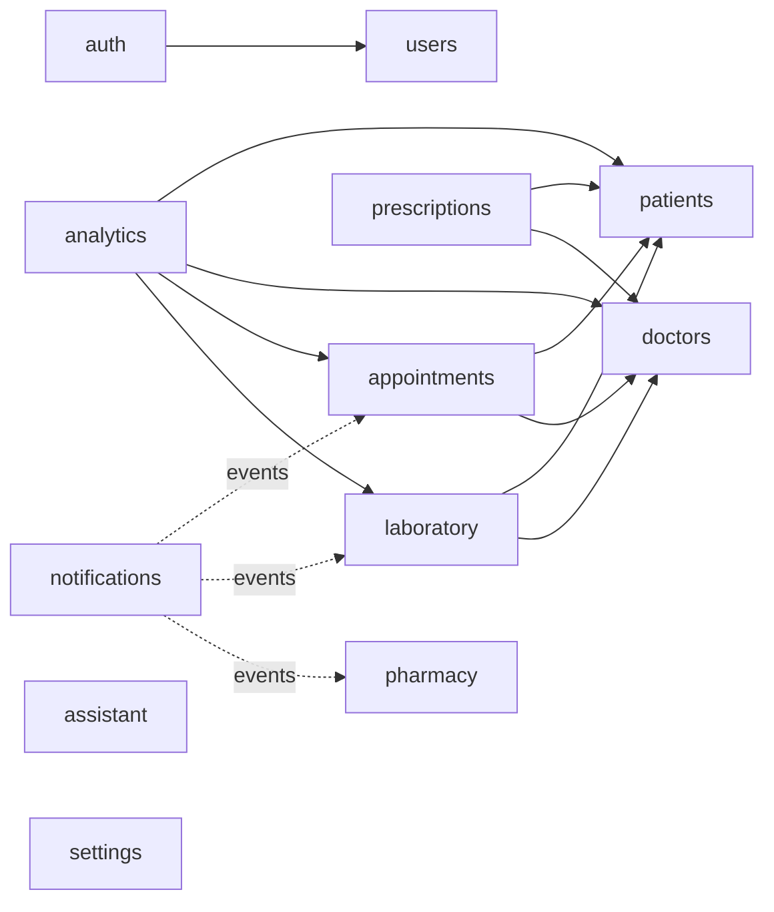

# MedFlow AI — Backend

Java 21 / Spring Boot 3.4 **modular monolith** (Spring Modulith) powering the MedFlow AI
clinical operating system. Every functional area of the MedFlow UI — dashboard, doctors,
patients, appointments, prescriptions, laboratory, pharmacy, reports & analytics,
notifications, AI assistant, user management, settings and authentication — is backed by
a dedicated, boundary-verified application module.

---

## Contents

1. [Quick start](#quick-start)
2. [Tech stack](#tech-stack)
3. [Architecture](#architecture)
4. [Modules & API surface](#modules--api-surface)
5. [Security model](#security-model)
6. [Cross-module events](#cross-module-events)
7. [Persistence & migrations](#persistence--migrations)
8. [Caching & observability](#caching--observability)
9. [Configuration](#configuration)
10. [Testing](#testing)
11. [Design decisions & trade-offs](#design-decisions--trade-offs)
12. [Adding a new module](#adding-a-new-module)
13. [Roadmap](#roadmap)

---

## Quick start

Prerequisites: **JDK 21**, **Maven 3.9+**, **Docker Desktop** (for PostgreSQL + Redis).

```bash
# 1. Start infrastructure (PostgreSQL 16 + Redis 7)
docker compose up -d

# 2. Run the application
mvn spring-boot:run
```

Then open:

| URL | What |
|---|---|
| `http://localhost:8080/swagger-ui/index.html` | Interactive API docs (supports Bearer auth) |
| `http://localhost:8080/health` | Public liveness endpoint |
| `http://localhost:8080/actuator/health` | Actuator probes |
| `http://localhost:8080/actuator/prometheus` | Prometheus metrics |

First call to make (no auth needed):

```bash
curl -X POST http://localhost:8080/api/v1/auth/register \
  -H "Content-Type: application/json" \
  -d '{"fullName":"Dr. Ananya Rao","email":"ananya@hospital.com","password":"changeit-123","confirmPassword":"changeit-123"}'
```

The **first registered user becomes the workspace ADMIN**; later signups default to
RECEPTIONIST until an admin changes their role. The response contains a JWT — pass it as
`Authorization: Bearer <token>` on every other call (or click *Authorize* in Swagger UI).

> No Docker? The test suite proves the app end-to-end without it:
> `mvn test` boots the full application against in-memory H2 in PostgreSQL mode.

---

## Tech stack

| Concern | Choice |
|---|---|
| Language / runtime | Java 21 |
| Framework | Spring Boot 3.4 (Web MVC, Data JPA, Validation, Security, Actuator) |
| Modularity | Spring Modulith 1.3 — build-time verified module boundaries |
| Auth | Spring Security OAuth2 Resource Server, HS256 JWT (no extra JWT library) |
| Database | PostgreSQL 16, Flyway migrations (module-owned folders) |
| Cache | Redis 7 via Spring Cache (soft dependency — app runs without it) |
| Mapping | MapStruct 1.6 (compile-time, reflection-free DTO mapping) |
| API docs | springdoc-openapi + Swagger UI |
| Metrics | Micrometer + Prometheus registry |
| Tests | JUnit 5, Spring Boot Test, Awaitility, H2 (PostgreSQL mode), Testcontainers (available) |

---

## Architecture

### Modular monolith

The codebase is a single deployable with **hard internal boundaries** enforced by
`ApplicationModules.verify()` in the test suite (`ModularityTest`). A module may only
touch another module's **published API** (its `api` package tree) or subscribe to its
**domain events** — never its entities, repositories or services.

```
com.medflow
├── MedflowApplication            @Modulithic entry point
├── config/                       Framework wiring (security, cache, OpenAPI, async, clock)
├── shared/                       OPEN shared kernel: ApiResponse envelope, PageResponse,
│                                 exceptions, @PublicApi marker, trace-id filter
└── modules/
    └── <module>/
        ├── package-info.java     @ApplicationModule declaration
        ├── api/                  @NamedInterface — service interface, enums, events
        │   ├── request/          @NamedInterface — inbound DTOs (validated records)
        │   └── response/         @NamedInterface — outbound DTOs (records)
        ├── application/          Service implementations (package-private)
        ├── controller/           Thin REST layer (package-private)
        ├── domain/
        │   ├── entity/           Rich JPA aggregates with behavior + invariants
        │   └── repository/       Spring Data repositories, Specifications
        └── mapper/               MapStruct entity → DTO mappers
```

### Module dependency graph



Solid arrows are synchronous API calls (e.g. appointments validates patient/doctor IDs
and fetches display names through batch `summariesByIds(...)` lookups). Dotted arrows
are **event subscriptions** — notifications never calls other modules; it listens.

Cross-module references are **by UUID only**. There are no cross-module JPA relations
and no cross-module foreign keys, so any module could later be extracted into its own
service without schema surgery.

### Conventions

- **Response envelope** — every endpoint returns
  `{ success, message, data, errors[], timestamp, traceId }`. The `traceId` is generated
  (or propagated from `X-Trace-Id`) by a servlet filter, stored in the MDC, echoed in
  the response header and stamped into every log line.
- **Pagination** — list endpoints take `page`/`size` (size capped at 100) and return a
  stable `PageResponse` decoupled from Spring Data types.
- **Errors** — one `@RestControllerAdvice` maps exceptions to statuses:
  validation → 400, unauthenticated → 401, forbidden → 403, not found → 404,
  duplicate → 409, domain-rule violation → 422, anything else → 500 (logged, opaque).
- **Domain invariants live in the aggregates** — e.g. `Appointment.confirm()` rejects
  anything but PENDING; `Medication.adjustStock()` refuses to go negative and reports
  reorder-threshold crossings. Services orchestrate; entities decide.

---

## Modules & API surface

All routes are prefixed `/api/v1`. 🔓 = public, 👑 = ADMIN only; everything else needs a
valid JWT.

### Auth (`/auth`)
| Method | Path | Notes |
|---|---|---|
| POST 🔓 | `/auth/register` | Sign up; first user becomes ADMIN; returns JWT |
| POST 🔓 | `/auth/login` | Credentials → JWT |
| POST 🔓 | `/auth/forgot-password` | Always 202; issues a 30-min reset token (logged until an email adapter exists) |
| POST 🔓 | `/auth/reset-password` | Consumes token, sets new password |
| GET | `/auth/me` | Current user profile |

### Users (`/users`)
| Method | Path | Notes |
|---|---|---|
| GET | `/users` | Directory search (`query`, paged) |
| GET | `/users/{id}` | One account |
| POST 👑 | `/users` | Invite staff with explicit role |
| PATCH 👑 | `/users/{id}/role` | ADMIN / DOCTOR / NURSE / LAB_TECHNICIAN / PHARMACIST / RECEPTIONIST |
| PATCH 👑 | `/users/{id}/status` | ACTIVE / DISABLED (disabled users cannot sign in) |

### Doctors (`/doctors`)
| Method | Path | Notes |
|---|---|---|
| POST 👑 | `/doctors` | Onboard with license, specialty, department, fee |
| GET | `/doctors` | Filter by `query`, `specialty`, `availability` |
| GET / PUT 👑 | `/doctors/{id}` | Profile / update |
| PATCH | `/doctors/{id}/availability` | AVAILABLE / ON_DUTY / ON_LEAVE |

### Patients (`/patients`)
| Method | Path | Notes |
|---|---|---|
| POST | `/patients` | Intake with contact, blood group, address |
| GET | `/patients` | Search by name/email, paged |
| GET / PUT | `/patients/{id}` | Profile / update incl. archive status (records are never deleted) |

### Appointments (`/appointments`)
| Method | Path | Notes |
|---|---|---|
| POST | `/appointments` | Book (PENDING); fee snapshotted from doctor; overlaps flagged via notification |
| GET | `/appointments` | Filter by `status`, `doctorId`, `patientId`, `date` |
| GET | `/appointments/{id}` | Includes patient/doctor display names |
| PATCH | `/appointments/{id}/confirm` | PENDING → CONFIRMED |
| PATCH | `/appointments/{id}/complete` | CONFIRMED → COMPLETED (fee counts toward revenue) |
| PATCH | `/appointments/{id}/cancel` | Cancels pending/confirmed |
| PATCH | `/appointments/{id}/reschedule` | Moves slot, resets to PENDING, re-checks conflicts |

### Prescriptions (`/prescriptions`)
| Method | Path | Notes |
|---|---|---|
| POST | `/prescriptions` | One or more medication line items |
| GET | `/prescriptions` | Patient history via `patientId`; also `doctorId`, `status` |
| GET | `/prescriptions/{id}` | With items |
| PATCH | `/prescriptions/{id}/complete` / `/cancel` | Lifecycle |

### Laboratory (`/lab-orders`)
| Method | Path | Notes |
|---|---|---|
| POST | `/lab-orders` | Order test (ROUTINE / URGENT / STAT) |
| GET | `/lab-orders` | Queue filtered by `status`, `priority`, `patientId` |
| PATCH | `/lab-orders/{id}/start` | ORDERED → IN_PROGRESS |
| PATCH | `/lab-orders/{id}/complete` | Records results; raises "Lab results ready" notification |
| PATCH | `/lab-orders/{id}/cancel` | Cancels non-completed order |

### Pharmacy (`/pharmacy/medications`)
| Method | Path | Notes |
|---|---|---|
| POST | `/pharmacy/medications` | Add to catalog with stock + reorder level |
| GET | `/pharmacy/medications` | `query` search; `lowStockOnly=true` for the reorder list |
| GET / PUT | `/pharmacy/medications/{id}` | Details / update |
| PATCH | `/pharmacy/medications/{id}/stock` | `delta` +restock/−dispense; crossing reorder level raises "Low stock alert" |

### Notifications (`/notifications`)
| Method | Path | Notes |
|---|---|---|
| GET | `/notifications` | Workspace feed, `unreadOnly` filter |
| GET | `/notifications/unread-count` | Sidebar badge |
| PATCH | `/notifications/{id}/read` / `/read-all` | Read management |

### Analytics (`/analytics`)
| Method | Path | Notes |
|---|---|---|
| GET | `/analytics/dashboard` | KPI cards: revenue MTD, total patients, doctors on staff, appointments today, lab reports completed, active cases |
| GET | `/analytics/activity?days=7` | Daily visit series for the activity chart |

### AI Assistant (`/assistant/messages`)
| Method | Path | Notes |
|---|---|---|
| POST | `/assistant/messages` | Send message, receive reply (conversation-scoped, persisted) |
| GET | `/assistant/messages` | Caller's history, optional `conversationId` |

### Settings (`/settings`)
| Method | Path | Notes |
|---|---|---|
| GET | `/settings` / `/settings/{key}` | Workspace configuration (seeded defaults) |
| PUT 👑 | `/settings/{key}` | Upsert a value |

---

## Security model

- **Stateless JWT** — `POST /auth/login` issues an HS256 token via Spring Security's
  own `JwtEncoder` (Nimbus, no third-party JWT dependency). Every other request is
  validated by the OAuth2 resource-server filter chain; no server-side sessions.
- **Claims** — `sub` = user id, plus `email`, `name` and `role`. The role claim maps to
  a `ROLE_*` authority consumed by `@PreAuthorize("hasRole('ADMIN')")` on privileged
  endpoints (user administration, doctor onboarding, settings writes).
- **Private by default** — every endpoint requires authentication unless its handler is
  annotated `@PublicApi` (a custom marker resolved by a handler-aware request matcher).
  Adding a new controller cannot accidentally expose it.
- **Passwords** — BCrypt-hashed; 8–72 character policy (72 is the BCrypt input limit).
- **Password reset** — opaque 256-bit token, 30-minute TTL, single-use, and the API
  responds identically whether or not the email exists (no account enumeration).
- **CORS** — locked to configured origins (defaults to the Vite dev server,
  `http://localhost:5173`).

---

## Cross-module events

Modules communicate significant facts through Spring Modulith application events
(`@ApplicationModuleListener` — async, after-commit, own transaction). The notifications
module turns them into the alert feed the UI shows:

| Event | Published by | Resulting notification |
|---|---|---|
| `AppointmentBookedEvent` | appointments | "Appointment booked — *patient* is scheduled with *doctor* at *time*" |
| `AppointmentScheduleConflictEvent` | appointments | ⚠ "Schedule conflict — *doctor* has overlapping bookings at *time*" |
| `LabOrderCompletedEvent` | laboratory | "Lab results ready — *patient*'s *test* results just came in" |
| `MedicationLowStockEvent` | pharmacy | ⚠ "Low stock alert — pharmacy flagged *medication* running low" |

Events carry display names so listeners need no lookups, keeping consumers decoupled
from producers' data models.

---

## Persistence & migrations

- **Flyway, module-owned** — each module keeps its DDL under
  `src/main/resources/db/migration/<module>/`; Flyway scans `db/migration` recursively.
  Version numbers are globally sequential (V1–V2 patients, V3 users, V4 doctors,
  V5 appointments, V6 prescriptions, V7 laboratory, V8 pharmacy, V9 notifications,
  V10 assistant, V11 settings).
- **`ddl-auto: validate`** — Hibernate never touches the schema; migrations are the
  single source of truth and startup fails fast on drift.
- **UUID primary keys** generated in the domain (aggregates are valid from birth),
  `TIMESTAMP WITH TIME ZONE` for instants, `NUMERIC(10,2)` for money, enums stored as
  strings. Indexes cover the hot query paths (doctor+time, patient, status, feed
  recency).

---

## Caching & observability

- **Dashboard cache** — the KPI aggregate is cached in Redis for 30 seconds. The cache
  is a *soft* dependency: a logging `CacheErrorHandler` swallows connectivity failures,
  so with Redis down the numbers are simply computed per request (verified by the smoke
  test).
- **Tracing** — `X-Trace-Id` accepted or generated per request, present in the MDC, all
  log lines (`[traceId=…]`), every response envelope and the response headers.
- **Metrics / probes** — Prometheus scrape endpoint and liveness/readiness probes via
  Actuator.

---

## Configuration

All settings live in `application.yml` and are overridable via environment variables:

| Variable | Default | Purpose |
|---|---|---|
| `DB_URL` | `jdbc:postgresql://localhost:5432/medflow` | PostgreSQL JDBC URL |
| `DB_USERNAME` / `DB_PASSWORD` | `medflow` / `medflow` | Database credentials |
| `REDIS_HOST` / `REDIS_PORT` | `localhost` / `6379` | Redis connection |
| `JWT_SECRET` | dev-only value | **Must be overridden outside local dev**; ≥ 32 bytes (HS256) |
| `JWT_TTL` | `PT8H` | Access-token lifetime (ISO-8601 duration) |
| `CORS_ALLOWED_ORIGINS` | `http://localhost:5173` | Comma-separated allowed origins |

---

## Testing

```bash
mvn test
```

| Test | What it proves |
|---|---|
| `ModularityTest` | No module reaches into another module's internals; no dependency cycles. Fails the build on any boundary violation. |
| `MedflowSmokeTest` | Boots the **entire application** (Flyway → JPA validation → security chain) on H2 in PostgreSQL mode and walks the cross-module happy path: register (first user = ADMIN) → login → onboard doctor → register patient → book appointment → async event produces a notification → dashboard KPIs reflect the data — all with Redis absent, proving graceful cache degradation. |

Testcontainers (PostgreSQL) is on the test classpath for future repository-level tests
against the real database engine.

---

## Design decisions & trade-offs

- **Modular monolith over microservices** — one deployable with verified boundaries
  gives service-extraction options later without paying the distributed-systems tax now.
- **Conflicting bookings are flagged, not blocked** — the UI surfaces schedule conflicts
  as notifications ("Dr. Shah has two bookings at 2:00 PM"), so the domain follows:
  front-desk staff resolve conflicts; the system never silently rejects a patient.
  Flip to hard rejection by throwing in `AppointmentServiceImpl.book` where the
  conflict event is published.
- **Prescription items store medication as text** — a prescription is a clinical
  record; it must stay accurate even if the pharmacy catalog is renamed or pruned.
  Pharmacy inventory is deliberately a separate concern.
- **Patients are archived, never deleted** — `PUT /patients/{id}` with
  `status=INACTIVE`; medical records must not disappear.
- **Revenue = completed appointments' fees** — the fee is snapshotted at booking time,
  so later fee changes don't rewrite history. A dedicated billing module can replace
  this KPI source later.
- **Assistant is a port, not a fake** — `AssistantResponder` is the single interface to
  implement with a real LLM (e.g. Claude API). The default adapter returns honest,
  deterministic guidance instead of pretending to be an AI.
- **Notifications are workspace-scoped** — one shared feed matching the UI. Per-user
  targeting and read receipts are an additive change (recipient table keyed by
  notification id).
- **UTC everywhere** — day boundaries ("appointments today", the activity chart) are
  computed in UTC via an injectable `Clock`; clinic-local timezones are a presentation
  concern.

## Adding a new module

1. Create `com.medflow.modules.<name>` with a `package-info.java` annotated
   `@ApplicationModule`.
2. Put the service interface, enums and events in `api/` (annotated `@NamedInterface`),
   DTO records under `api/request` / `api/response` (same annotation, distinct names).
3. Keep `application/`, `controller/`, `domain/`, `mapper/` package-private.
4. Add Flyway DDL under `db/migration/<name>/V<next>__*.sql` (next global version).
5. Depend on other modules only via their `api` interfaces or events.
6. Run `mvn test` — `ModularityTest` will reject any boundary violation.

## Roadmap

- Refresh tokens + token revocation list (Redis is already in place).
- Email adapter for password reset and appointment reminders.
- LLM-backed `AssistantResponder` (Claude API) with patient-record grounding.
- Per-recipient notifications with read receipts and delivery preferences.
- Billing module (invoices, payments) to replace the appointment-fee revenue KPI.
- Report exports (CSV/PDF) on top of the analytics module.
- Audit log for user-management actions (the UI's Users page lists it).
